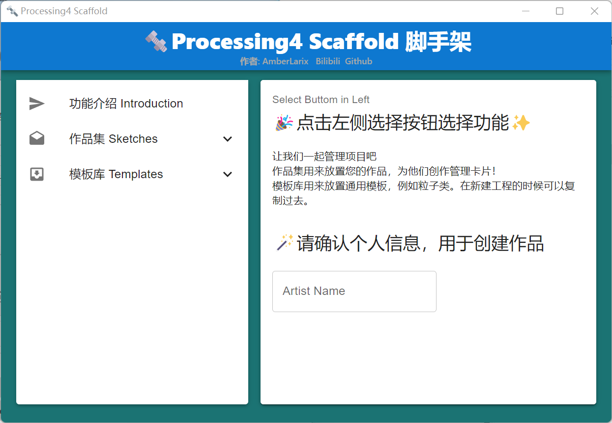

# 🔩Processing4-Scaffold
This is an easy structure maker for processing4 project

### 技术选型 Technique Choose
1. python38
2. pywebview、virtualenv、cx_freeze
3. React18
4. Material UI、Vite

### 功能说明 Function Description
1. 本项目用于processing4项目的构建，提供windows操作系统下的项目管理、画廊、快捷复制、构建自定义库的辅助功能
2. 友善的使用界面

